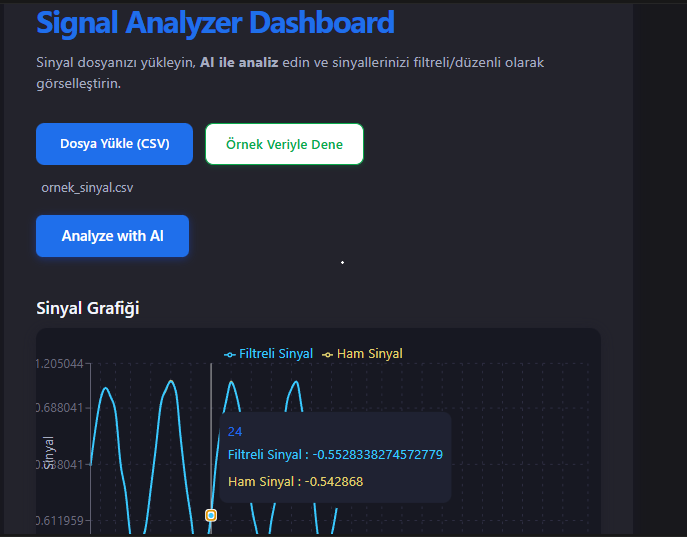

# NeuroStream AI - Akıllı Sinyal Analiz Platformu

Bu proje, biyomedikal sinyallerin (EEG, EMG vb.) gerçek zamanlı analizi, filtrelenmesi ve AI destekli yorumlanması için geliştirilmiş uçtan uca bir platformdur.

## Öne Çıkan Özellikler
- **Gerçek Zamanlı Filtreleme:** Python FastAPI tabanlı backend, 50Hz şebeke gürültüsünü Notch Filtresi ile temizler.
- **Modern Dashboard:** Next.js ve Recharts ile interaktif sinyal görselleştirme.
- **AI Analizi:** Sinyal istatistiklerini yorumlayan akıllı raporlama katmanı.
- **Kullanıcı Dostu:** Jüri ve test kullanıcıları için "Örnek Veriyle Dene" butonu entegre edilmiştir.

## Teknik Stack
- **Backend:** Python (FastAPI, SciPy, Pandas, NumPy)
- **Frontend:** TypeScript, Next.js, Tailwind CSS, Recharts
- **Araçlar:** Cursor AI, Git

## Yerel Kurulum
1. Backend: `cd backend && uvicorn main:app --reload`
2. Frontend: `cd frontend && npm run dev`
3. Tarayıcıda `http://localhost:3000` adresine gidin.

## Mühendislik Detayları: Neden 50Hz Notch Filtresi?
Biyomedikal ölçümlerde (EEG/EMG), prizlerden yayılan şebeke gürültüsü sinyal üzerinde ciddi bir kirlilik yaratır. Bu projede kullanılan IIR Notch Filter, sinyalin ana yapısını bozmadan sadece 50Hz frekansındaki bu gürültüyü sönümleyerek tıbbi açıdan anlamlı verilerin ortaya çıkmasını sağlar.

---

## Geliştirici
**Elif Atalar** - *Elektrik-Elektronik Mühendisliği 3.Sınıf Öğrencisi | Ondokuz Mayıs Üniversitesi*
